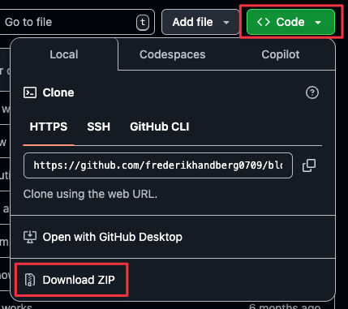

## BLOP

BLOP is a social network I created as a portfolio project, designed to closely mirror the functionality of modern social media platforms. My goal was to make it as realistic and feature-rich as possible, providing users with an experience they would expect from today’s social networks.

## Project Features

### Posts and Interactions

- **Publish posts** with text, images, or videos.
- **Comment on posts** to engage in discussions.
- **Reply to comments**, allowing direct responses.
- **Nested replies** (similar to Reddit) for deeper conversations.

### Account & Profile Management

- **Edit and customize profile**, including:
  - Username
  - Profile name
  - Profile picture & banner
  - Bio
- **Change email** associated with the account.
- **Reset password** for account security.
- **Link multiple accounts** for seamless switching between them.

### Content Management

- **Save drafts** of posts, comments, and replies for later editing.
- **Edit posts, comments, and replies**, with a revision history to track changes.
- **Delete posts, comments, and replies** to remove unwanted content.

### Moderation Tools

- **Mute users** to hide their content.
- **Block users** to prevent interaction.
- **Filter content** by blocking specific words, hiding any content containing them.

## Getting Started

**Prerequisites**

- Node.js (v18 or later)
- npm or yarn
- Git

**Step 1: Clone the Repository**

Option 1: Clone via Git
Run the following command in your terminal:
`git clone https://github.com/frederikhandberg0709/blop-social-media.git`

Option 2: Download ZIP

1. Click the green `Code` dropdown button
2. Select `Download ZIP`
3. Extract the downloaded ZIP file to your desired location



**Step 2: Install Dependencies**

```bash
npm install
# or
yarn install
```
